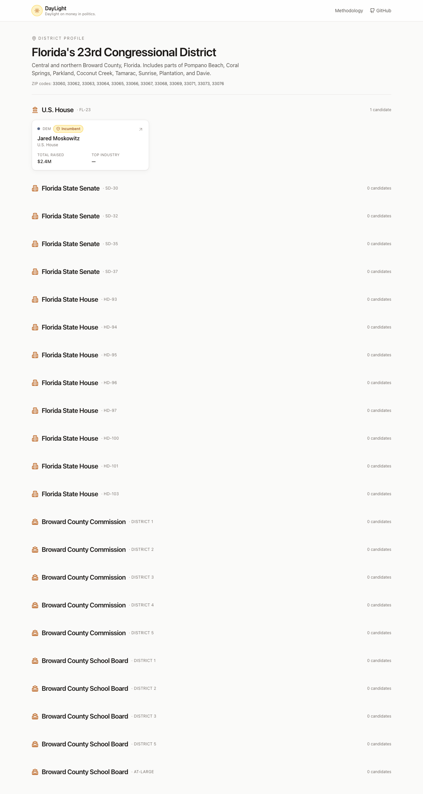

# DayLight

[](./LICENSE)
[](./docs/methodology.md)
[](./CONTRIBUTING.md)

> **Daylight on money in politics — district by district.**

DayLight shows voters who funds the politicians on their ballot — from the U.S. House all the way down to the school board and the soil-and-water conservation district. It pulls together public campaign-finance data that already exists (it's just scattered across a dozen different government and nonprofit sites) and renders it as one straightforward view per race: top donors, industry concentration, vote-vs-donor alignment, and a short plain-English summary of where a politician's stated positions sit alongside the money behind them.

It's built for the curious voter, the local journalist, the high-school civics class, and the neighbor who just wants to know who's actually paying for the yard signs.




## Why I'm releasing this as a gift

Citizens deserve to know who funds the politicians they vote for. The data exists — it's scattered across FEC.gov, OpenSecrets, ProPublica, state portals, county election offices. DayLight pulls it together into one view, focused on the down-ballot races nobody else covers clearly.

I built v1 for my district (FL-23, Broward County). I'm releasing it AGPL-3.0 and stepping back. Fork it for your district. Improve the methodology. Build the version your community needs. If a community maintainer steps up to steward the central project, I'll happily hand them the keys.

## What it covers (v1)

The default build covers Florida's 23rd Congressional District (Representative Jared Moskowitz) and the full down-ballot stack a voter in Broward County would actually see:

- U.S. House (FL-23)
- Florida State Senate (the districts overlapping FL-23)
- Florida State House (the districts overlapping FL-23)
- Broward County Commission
- Broward County School Board
- County, circuit, and appellate judges on the Broward ballot
- Soil and Water Conservation District seats

Other districts are added by dropping a YAML file into `/config/districts/`. See [the forking guide](./docs/forking-guide.md).

## What it doesn't cover (yet)

Being honest about the gaps matters more than pretending we've got everything:

- **Dark money** — 501(c)(4) "social welfare" groups are not required to disclose donors. We can show what they spend; we can't show who funded them.
- **In-kind contributions** — non-cash support (services, polling, mailing lists) is inconsistently reported across jurisdictions.
- **Independent expenditures** — Super PACs and outside groups are tracked separately and only partially integrated in v1.
- **Other districts** — until someone forks DayLight for their own area, only FL-23 ships out of the box.
- **Historical depth** — v1 emphasizes the current and immediately preceding cycle.

## Quick start

Assumes a recent macOS or Linux machine, Node 20+, Python 3.11+, and `git`.

```bash
git clone https://github.com/josephj357/DayLight.git
cd DayLight
cp .env.example .env             # add your API keys
bash scripts/seed.sh             # installs deps, runs ingestion, starts API
cd src/web && npm install && npm run dev
# Open http://localhost:3000
```

The `seed.sh` script pulls public data from FEC, Congress.gov, OpenSecrets bulk data, and state/county sources into a local SQLite database, so you don't need a managed database to evaluate the project.

## Fork it for your district

DayLight is designed so that one YAML file describes one district. The reference file is [`/config/districts/fl-23.yml`](./config/districts/fl-23.yml) — it lists the offices on the ballot, the relevant state and county data sources, and the geographic identifiers used to filter federal data.

Step-by-step instructions are in [`/docs/forking-guide.md`](./docs/forking-guide.md). The walkthrough covers mapping local races to the DayLight schema, finding your state's campaign-finance disclosure system, adapting the scrapers, AI-synthesis costs, hosting options, and the legal considerations of publishing this kind of data.

## Methodology

DayLight's analysis is intentionally boring: aggregate disclosed contributions by donor and by industry, compare those concentrations to a politician's stated positions and recorded votes, and surface contradictions in plain English. No proprietary scores, no opaque rankings.

The full methodology — including how we classify industries, what counts as a "top donor," and how we generate the AI summaries — is in [`/docs/methodology.md`](./docs/methodology.md). That document is licensed **CC BY-SA 4.0** specifically so other civic-tech tools can adopt and adapt it without friction.

## Political neutrality

DayLight applies identical scrutiny to all parties. Same data sources, same thresholds, same prompts, same review process. A donor concentration that's flagged for one politician is flagged the same way for another. A contradiction surfaced for one party is surfaced the same way for the other.

Contributions that introduce asymmetric scrutiny, partisan framing, or loaded language will be reverted regardless of which side they target. This is not negotiable, and it's a core part of why the project is being given away rather than monetized.

## Want to maintain this?

I'm not actively maintaining DayLight. I built v1, I'm releasing it, and I'm stepping back to let people who care about this — journalists, civic-tech folks, local volunteers — pick it up.

If you want to steward the central project, open an issue tagged `[Maintainer Application]`. Tell me a little about why you're interested. If it's a good fit, I'll hand over the keys.

## Contributing

See [`CONTRIBUTING.md`](./CONTRIBUTING.md). Short version: PRs are welcome, the neutrality contract is strict, and adding a new district is the friendliest place to start.

## Acknowledgments

DayLight is mostly a thin layer over the work of organizations that have spent years making this data accessible. In particular:

- **Federal Election Commission (FEC)** — federal campaign-finance disclosures
- **Congress.gov** (Library of Congress) — congressional voting records and member metadata (the project previously used the ProPublica Congress API; ProPublica shut that API down in July 2024)
- **OpenSecrets** (Center for Responsive Politics) — industry classifications and donor research (note: OpenSecrets discontinued their live API in April 2025; DayLight reads their bulk-data exports under CC BY-NC-SA 3.0)
- **Florida Division of Elections** — state-level campaign-finance disclosures
- **Broward County Supervisor of Elections** — local candidate and ballot data
- **U.S. Senate Office of Public Records (LDA)** — lobbying disclosure data

If you use DayLight, please consider supporting these organizations directly — they do the hard work.

## License

DayLight is licensed under **AGPL-3.0** ([LICENSE](./LICENSE)).

In practical terms: you can use, modify, and redistribute DayLight freely, including for commercial purposes. But if you run a modified version of DayLight as a network service (a hosted site, a SaaS, anything users interact with over a network), you must publish your modifications under the same license. This is what keeps DayLight a public good rather than something a private company can quietly fork, close, and sell back to voters.

The methodology document (`/docs/methodology.md`) is separately licensed CC BY-SA 4.0, so other civic-tech projects can adopt the methodology without inheriting AGPL.
